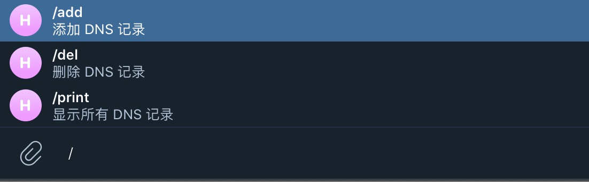

## dnsbot

> 这是一个为 [etcdhosts](https://github.com/ytpay/etcdhosts) 插件编写的 Telegram 机器人。

### 一、如何使用

#### 1.1、二进制启动

从 [Release](https://github.com/mritd/dnsbot/releases) 页下载预编译二进制文件，直接启动既可；**使用前提是你需要自己创建 Telegram 机器人，
并且部署该机器人的网络能正常访问 Telegram API(或访问其代理地址)。**

```sh
➜ ./dnsbot_darwin_amd64 --config ../dnsbot.yaml 
2020-12-14 23:24:00     INFO    DNS Bot Starting...
```

#### 1.2、Docker 运行

本项目已经发布了预编译的 Docker 镜像到 [Docker Hub]()，Docker 用户可以直接运行:

```sh
docker run -dt --name dnsbot -v `pwd`/dnsbot.yaml:/etc/dnsbot.yaml mritd/dnsbot --config /etc/dnsbot.yaml
```

### 二、配置文件

dnsbot 配置文件采用 yaml 格式，其配置如下:

```yaml
# 机器人 Toekn
bot_token: "1402163:AAF1ktxkF_WfEabJsJ0rWnFqyfY"
# 允许调用该机器人的用户 IP 列表
bot_admins:
  - "3053639"
# 允许调用该机器人的组 ID 列表
bot_admin_groups:
  - "-4565493"
# etcdhosts 插件实用的 etcd key
etcd_host_key: /etcdhosts
# etcd 相关 证书
# 注意: 证书可以采用 base64 编码直接粘贴在此
#       也可以使用证书的绝对路径指定证书文件
# base64 编码命令: cat /etc/etcd/ssl/etcd.pem | base64 | tr -d '\n'
etcd_ca: LS0tLS1CRUdJTiBDRVJUSUZJQ0FURS0tLS0t...
etcd_cert: LS0tLS1CRUdJTiBDRVJUSUZJQ0FURS0tLS0t...
etcd_key: LS0tLS1CRUdJTiBSU0EgUFJJVkFURSBLRVkt...
# etcd 集群地址
etcd_endpoints:
  - https://172.16.1.21:2379
  - https://172.16.1.22:2379
  - https://172.16.1.23:2379
```

### 三、机器人使用样例



- `/add [domain] [ip]`: 域名或 IP 缺少时会进入交互式处理，默认 5m 超时
- `/del [domain]`: 域名缺少时进入交互式处理，默认 5m 超时
- `/print`: markdown 格式回复消息(包含所有域名记录)
